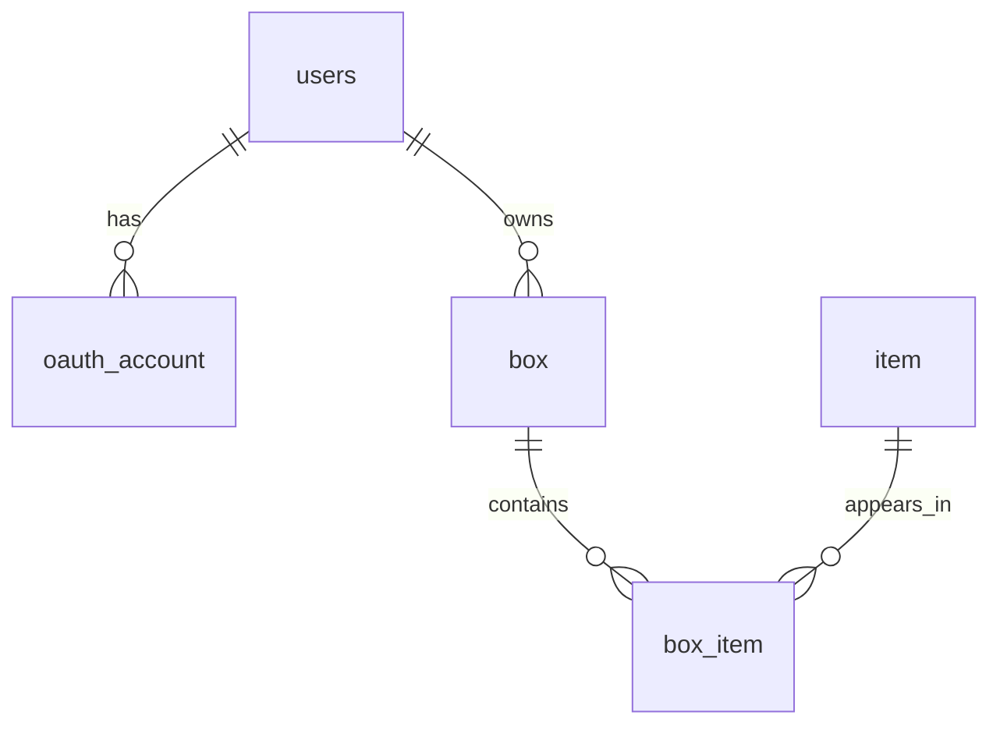

# BoomBoxDB Backend Contract (v1)
Wow. Gasp. So Human Readable. 

## 1) Scope
This contract defines the PostgreSQL schema and query patterns used by the Go backend for:
- OAuth-linked users
- Boxes identified by QR `image_url`
- Item catalog
- Many-to-many box contents via `box_item`

Database: `boombox-local`
Schema: `boombox`

---

## 2) Entity Relationship Overview
Praise be the production quality up in here.



---

## 3) Tables
Don't look at me. I fed this to Copilot and told it to make me pretty.

### 3.1 `boombox.users`
Purpose: Local app user profile.

| Column      | Type         | Null | Constraints |
|-------------|--------------|------|-------------|
| user_id     | BIGINT       | NO   | PK, identity |
| username    | CITEXT       | NO   | UNIQUE |
| display_name| TEXT         | YES  | - |
| is_active   | BOOLEAN      | NO   | default true |
| created_at  | TIMESTAMPTZ  | NO   | default now() |
| updated_at  | TIMESTAMPTZ  | NO   | default now() |

---

### 3.2 `boombox.oauth_account`
Purpose: OAuth identity mapping + token lifecycle. Got these items from the Echo article linked on 8-12-26.

| Column             | Type        | Null | Constraints |
|--------------------|-------------|------|-------------|
| oauth_account_id   | BIGINT      | NO   | PK, identity |
| user_id            | BIGINT      | NO   | FK -> users.user_id ON DELETE CASCADE |
| provider           | TEXT        | NO   | CHECK provider IN ('github') |
| provider_user_id   | TEXT        | NO   | UNIQUE with provider |
| provider_login     | CITEXT      | YES  | indexed |
| provider_email     | CITEXT      | YES  | - |
| access_token       | TEXT        | NO   | sensitive |
| refresh_token      | TEXT        | YES  | nullable |
| token_type         | TEXT        | NO   | default 'bearer' |
| scope              | TEXT        | YES  | - |
| expires_at         | TIMESTAMPTZ | YES  | indexed |
| revoked_at         | TIMESTAMPTZ | YES  | - |
| last_used_at       | TIMESTAMPTZ | YES  | - |
| created_at         | TIMESTAMPTZ | NO   | default now() |
| updated_at         | TIMESTAMPTZ | NO   | default now() |

Unique constraints:
- `(provider, provider_user_id)`
- `(user_id, provider)`

---

### 3.3 `boombox.box`
Purpose: Physical/storage box owned by a user. `image_url` is the canonical QR key.

| Column      | Type        | Null | Constraints |
|-------------|-------------|------|-------------|
| box_id      | BIGINT      | NO   | PK, identity |
| user_id     | BIGINT      | NO   | FK -> users.user_id ON DELETE CASCADE |
| box_name    | TEXT        | NO   | UNIQUE with user_id |
| image_url   | TEXT        | NO   | UNIQUE, CHECK not blank |
| created_at  | TIMESTAMPTZ | NO   | default now() |
| updated_at  | TIMESTAMPTZ | NO   | default now() |

Unique constraints:
- `(user_id, box_name)`
- `(image_url)`

---

### 3.4 `boombox.item`
Purpose: Catalog of unique item types.

| Column      | Type        | Null | Constraints |
|-------------|-------------|------|-------------|
| item_id     | BIGINT      | NO   | PK, identity |
| item_name   | TEXT        | NO   | UNIQUE |
| created_at  | TIMESTAMPTZ | NO   | default now() |

---

### 3.5 `boombox.box_item`
Purpose: Junction table linking boxes and items; tracks quantity.

| Column      | Type        | Null | Constraints |
|-------------|-------------|------|-------------|
| box_id      | BIGINT      | NO   | FK -> box.box_id ON DELETE CASCADE |
| item_id     | BIGINT      | NO   | FK -> item.item_id ON DELETE RESTRICT |
| quantity    | INTEGER     | NO   | CHECK quantity > 0 |
| created_at  | TIMESTAMPTZ | NO   | default now() |
| updated_at  | TIMESTAMPTZ | NO   | default now() |

Primary key:
- `(box_id, item_id)`

---

## 4) Behavioral Rules

1. `image_url` uniquely identifies a box for QR lookup.
2. Each `(box_id, item_id)` appears at most once. Composite keys, compadre.
3. `quantity > 0`; delete row when quantity reaches zero. Or in theory, should.
4. Deleting a user deletes their boxes and box items (delete on cascade).
5. `item` rows are restricted from delete while referenced by `box_item`. In theory.

---

## 5) Canonical Queries
Like the Bible, but much more heretical. 

(Requires testing with sample data before I'm confident these all work.)

### 5.1 Get box contents by QR (`image_url`)
```sql
SELECT b.box_id, b.box_name, b.image_url, i.item_name, bi.quantity
FROM boombox.box b
JOIN boombox.box_item bi ON bi.box_id = b.box_id
JOIN boombox.item i ON i.item_id = bi.item_id
WHERE b.image_url = $1
ORDER BY i.item_name;
```

### 5.2 Add quantity of item by QR
```sql
-- params: $1=image_url, $2=item_name, $3=qty_to_add
WITH upsert_item AS (
  INSERT INTO boombox.item(item_name)
  VALUES ($2)
  ON CONFLICT (item_name) DO UPDATE SET item_name = EXCLUDED.item_name
  RETURNING item_id
)
INSERT INTO boombox.box_item(box_id, item_id, quantity)
SELECT b.box_id, ui.item_id, $3
FROM boombox.box b
CROSS JOIN upsert_item ui
WHERE b.image_url = $1
ON CONFLICT (box_id, item_id)
DO UPDATE SET
  quantity = boombox.box_item.quantity + EXCLUDED.quantity,
  updated_at = now();
```


### 5.3 Remove quantity of item by QR
```sql
-- params: $1=image_url, $2=item_name, $3=qty_to_remove
UPDATE boombox.box_item bi
SET quantity = bi.quantity - $3,
    updated_at = now()
FROM boombox.box b
JOIN boombox.item i ON i.item_name = $2
WHERE bi.box_id = b.box_id
  AND bi.item_id = i.item_id
  AND b.image_url = $1
  AND bi.quantity >= $3;

DELETE FROM boombox.box_item bi
USING boombox.box b, boombox.item i
WHERE bi.box_id = b.box_id
  AND bi.item_id = i.item_id
  AND b.image_url = $1
  AND i.item_name = $2
  AND bi.quantity = 0;
```

---
## 6) Backend Notes for Go integration

- (`$1`, `$2`, `$3`) in my queries are for parameterized SQL 

---

## 7) Versioning

- Contract version: `v1`
- Last updated: `2026-08-12`
- Change policy: update the schema, update the damb docerment
